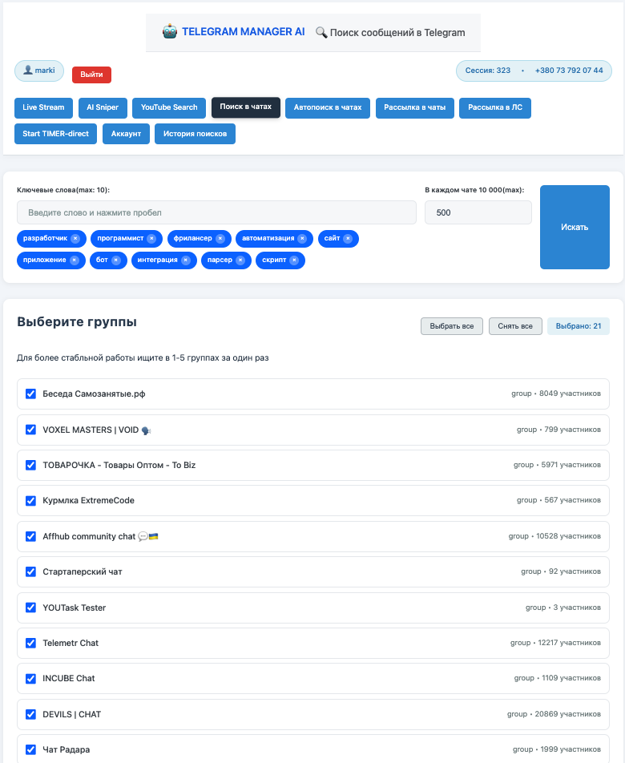
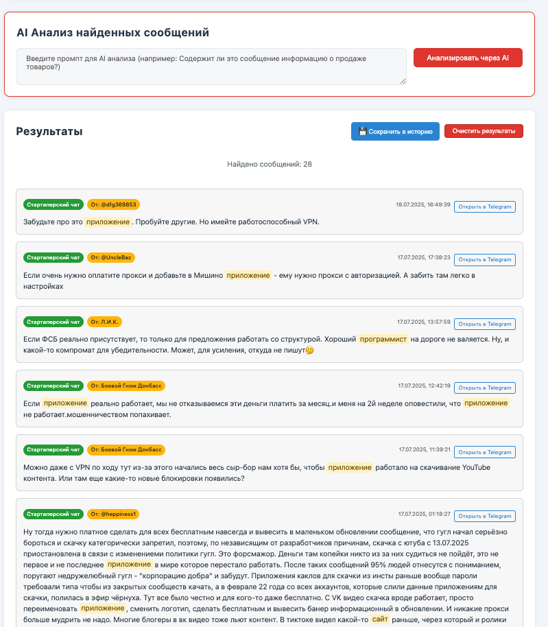
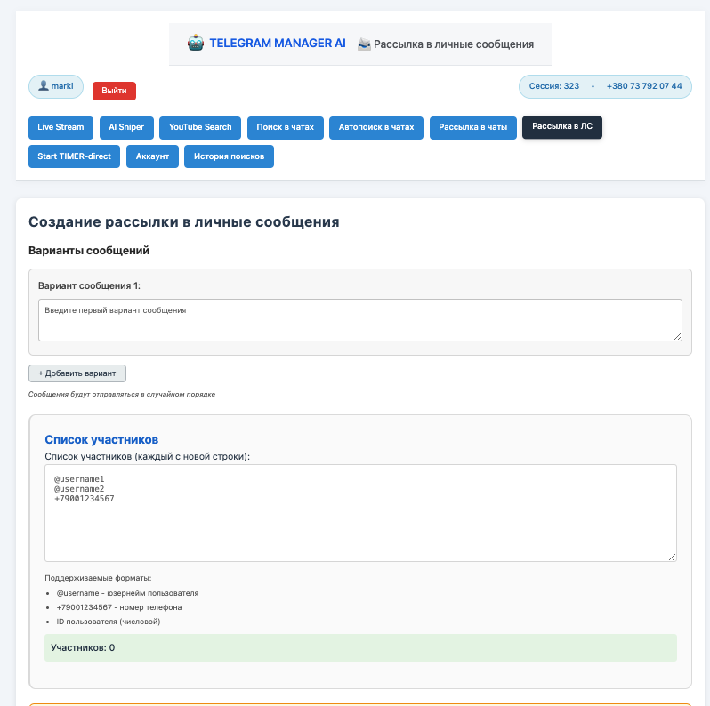
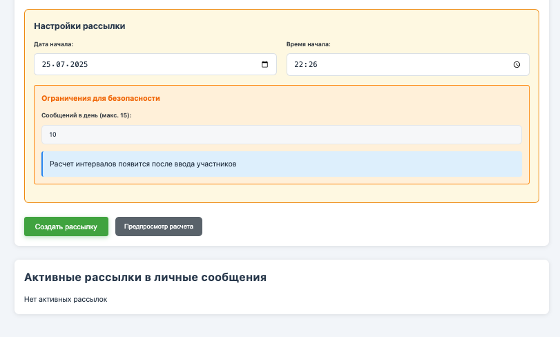
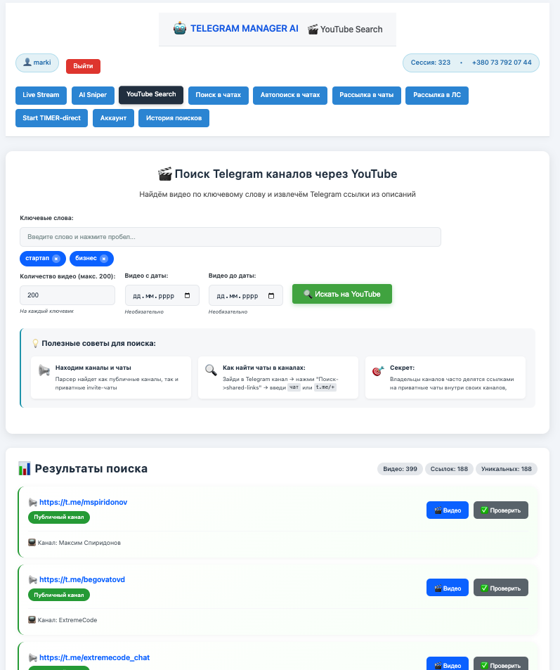
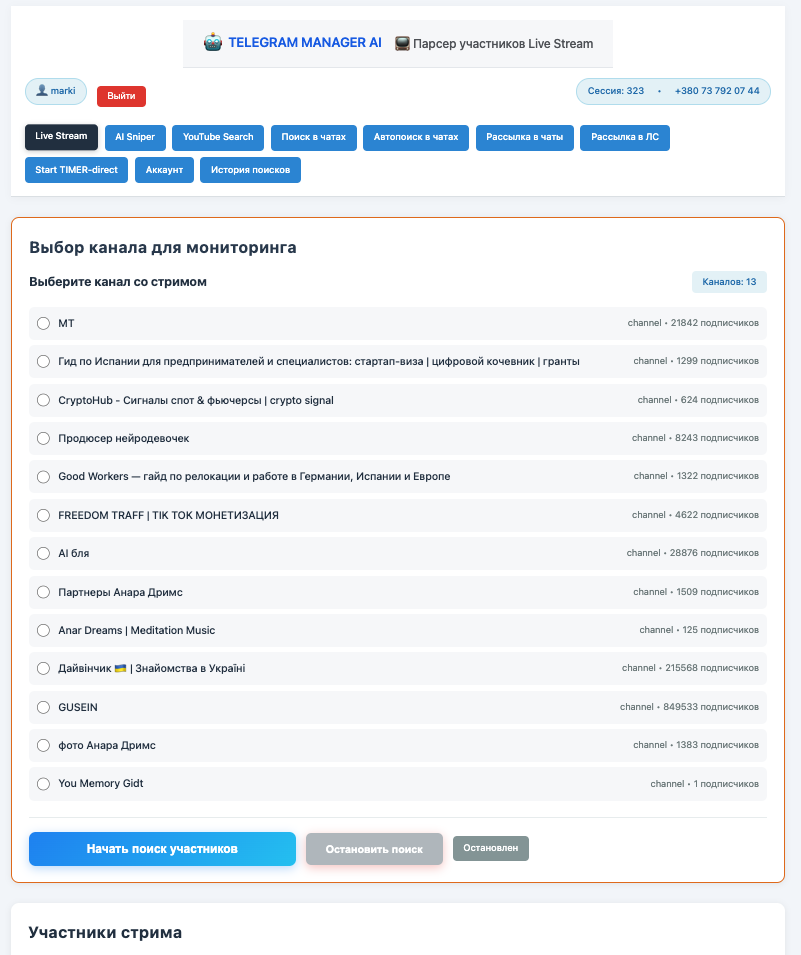

# 🤖 TELEGRAM MANAGER AI

**Мощный AI-инструмент для Telegram: поиск сообщений, автоматизация и массовая рассылка.**  
Если нужен аналогичный проект или доработка — **пиши прямо сейчас: [@god_devils_666_777](https://t.me/god_devils_666_777)**

---

## 🚀 Что я делаю на заказ?
- **Разработка Telegram-ботов и парсеров**
- **Автоматизация бизнес-процессов**
- **Интеграция с API и базами данных**
- **Создание веб-приложений и панелей управления**

---
[](image/1.png?raw=true)
[](image/2.png?raw=true)

[](image/3.png?raw=true)

[](image/4.png?raw=true)
[](image/5.png?raw=true)
[](image/6.png?raw=true)


[](image/1.png)
[](image/2.png)
[](image/3.png)
[](image/4.png)
[](image/5.png)
[](image/6.png)

## ✨ Основные возможности проекта

### 🔍 **Поиск сообщений**
- Поиск по ключевым словам в выбранных группах  
- Фильтрация по количеству сообщений  
- Подсветка ключевых слов  
- Прямые ссылки на найденные сообщения  

### 🤖 **AI-Анализ (Google Gemini)**
- Анализ контента найденных сообщений  
- Фильтрация по кастомным AI-промптам  
- Интеллектуальная обработка текста  

### ⚡ **Автопоиск в реальном времени**
- Мониторинг новых сообщений 24/7  
- Уведомления о совпадениях  
- Настраиваемые интервалы проверки  

### 📢 **Массовая рассылка**
- Планировщик отложенных рассылок  
- Рандомная рассылка в течение суток  
- Управление активными задачами  

### 👤 **Управление сессиями**
- Поддержка нескольких Telegram-аккаунтов  
- Переключение между сессиями  
- Безопасное хранение данных  

---

## 🛠 **Технологии**
**Backend:**
- Node.js (v18+)  
- Express.js  
- Telegram API (gramJS)  
- Session Management  

**Frontend:**
- Vanilla JS, HTML5, CSS3  
- Fetch API  

**Библиотеки:**
- `telegram (gramJS)` — работа с Telegram API  
- `@google/generative-ai` — AI анализ  
- `node-telegram-bot-api` — расширенные функции  
- `input` — интерактивный ввод  

**Форматы данных:**
- JSON — обмен данными  
- StringSession — хранение сессий  
- LocalStorage & File Storage  

---

## 📦 **Установка**

### **1. Предварительные требования**
- Node.js 18+  
- Аккаунт Telegram  
- API ID & Hash (получить [здесь](https://my.telegram.org))  
- Google Gemini API ключ ([aistudio.google.com](https://aistudio.google.com))  

### **2. Установка**
```bash
git clone <repository-url>
cd telegram-search-bot
npm install
